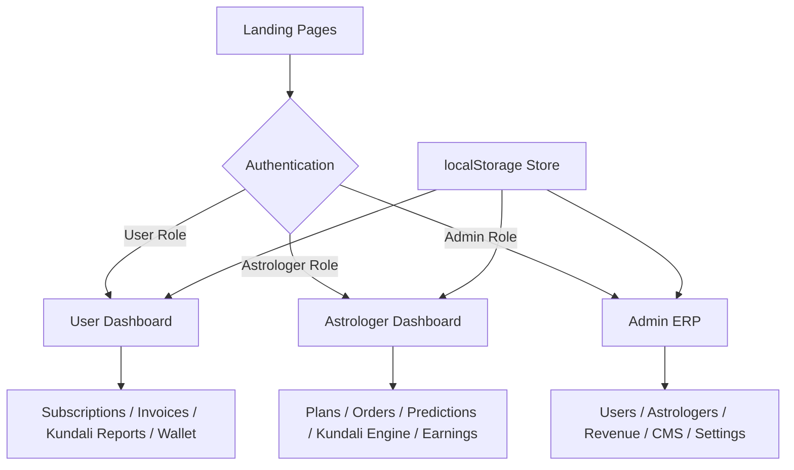

# Samriddhi-Ventures — Indian Astrology ERP SaaS Platform

## Overview

**Platform**: Samriddhi-Ventures  
**Tagline**: "Unlock Your Sacred Destiny Through Stars"  
**Stack**: HTML5 + CSS3 + JavaScript + Bootstrap 5 
**Framework**: CodeIgniter 3 
**Database**: MySQL 
**Target Scale**: 100,000+ concurrent users  
**Theme**: Premium Vedic Astrology with Glassmorphism + Enterprise Dashboard

This is a fully static frontend ERP system — all data is simulated via JavaScript/localStorage for a live demo-ready experience, with clearly marked API integration points for a Laravel backend.

---

## User Review Required

> [!IMPORTANT]
> **Scope Clarification**: This is an enormous platform (60+ pages, 3 dashboards, 4 roles). I will build it as a **fully functional static frontend** (HTML + CSS + JS) that is production-ready for demonstration and can be connected to any backend (Laravel, Node.js etc). All CRUD operations will work via localStorage simulation.

> [!IMPORTANT]
> **Build Strategy**: Given the scale, I will use a **generator script approach** (similar to your EduCore project) to programmatically generate all dashboard sub-pages from a master template, ensuring consistency across all 60+ pages without repetition.

> [!WARNING]
> **Phased Delivery**: Due to the massive scope, I'll build in phases. Phase 1 establishes the design system + core pages. Phase 2 builds out all dashboards. Phase 3 adds all utility pages. Each phase will be a complete, functional deliverable.

---

## Open Questions

> [!IMPORTANT]
> **Decision Required**: Should I generate ALL pages in one shot using the generator script approach (faster, consistent), or build each page manually (slower, more custom per page)?

> [!NOTE]
> I will default to the **generator script** approach for dashboard sub-pages and build key landing pages manually for maximum visual impact.

---

## Design System

### Color Palette
| Token | Hex | Usage |
|---|---|---|
| `--saffron` | `#FF6B00` | Primary CTAs, highlights |
| `--gold` | `#C8931A` | Accents, borders, stars |
| `--gold-light` | `#F0C040` | Glow effects, icons |
| `--navy` | `#0B1C3A` | Dark background |
| `--navy-mid` | `#132444` | Cards, sidebar |
| `--cream` | `#FBF6EF` | Light mode backgrounds |
| `--text-light` | `#E8DCC8` | Body text on dark |

### Typography
- **Cinzel** — Headings, logo, sacred elements
- **Playfair Display** — Sub-headings, premium labels
- **Mulish** — Body text, UI elements

### Components
- Glassmorphism cards with gold border glow
- Cosmic particle background (canvas-based)
- Sanskrit quote banners
- Mandala/Sacred geometry decorative elements
- Zodiac sign icon set (SVG inline)
- Kundali chart canvas renderer

---

## Folder Structure

```
sv-erp/
├── index.html                          # Landing Home Page
├── about.html
├── contact.html
├── privacy-policy.html
├── terms.html
├── refund-policy.html
├── careers.html
├── blog/
│   ├── index.html                      # Blog Listing
│   └── detail.html                     # Blog Detail
├── astrologers/
│   ├── index.html                      # Astrologer Listing
│   └── detail.html                     # Astrologer Profile
├── tools/
│   ├── kundali-generator.html
│   ├── kundali-matching.html
│   ├── daily-horoscope.html
│   ├── yearly-horoscope.html
│   ├── panchang.html
│   ├── muhurat.html
│   ├── festival-calendar.html
│   └── shop.html
├── auth/
│   ├── login.html
│   └── register.html
├── user/
│   ├── index.html                      # User Dashboard Home
│   ├── profile.html
│   ├── subscriptions.html
│   ├── invoices.html
│   ├── kundali-reports.html
│   ├── kundali-matching.html
│   ├── horoscope-reports.html
│   ├── consultations.html
│   ├── wallet.html
│   ├── notifications.html
│   ├── support.html
│   ├── referrals.html
│   └── transactions.html
├── astrologer/
│   ├── index.html                      # Astrologer Dashboard Home
│   ├── profile.html
│   ├── service-plans.html
│   ├── customers.html
│   ├── orders.html
│   ├── predictions.html
│   ├── kundali-engine.html
│   ├── earnings.html
│   ├── withdrawals.html
│   ├── calendar.html
│   ├── live-chat.html
│   ├── video-consultations.html
│   ├── notifications.html
│   └── support.html
├── admin/
│   ├── index.html                      # Admin Dashboard Home
│   ├── profile.html
│   ├── users.html
│   ├── astrologers.html
│   ├── subscription-plans.html
│   ├── invoices.html
│   ├── payments.html
│   ├── revenue-reports.html
│   ├── support.html
│   ├── cms-pages.html
│   ├── blogs.html
│   ├── testimonials.html
│   ├── notifications.html
│   ├── referrals.html
│   ├── wallet.html
│   ├── coupons.html
│   ├── gst.html
│   ├── seo.html
│   ├── email-templates.html
│   ├── sms-templates.html
│   ├── push-notifications.html
│   └── settings.html
├── assets/
│   ├── css/
│   │   ├── design-system.css           # Master design tokens + utilities
│   │   ├── landing.css                 # Landing page specific
│   │   ├── auth.css                    # Auth pages
│   │   ├── dashboard.css               # Shared dashboard layout
│   │   └── components.css              # Reusable components
│   ├── js/
│   │   ├── core.js                     # Shared utilities, auth check
│   │   ├── cosmic-bg.js                # Canvas particle/star animation
│   │   ├── charts.js                   # Chart.js wrappers
│   │   ├── kundali.js                  # Kundali chart renderer
│   │   ├── kundali-engine.js           # Vedic calculation engine
│   │   ├── store.js                    # localStorage data store
│   │   └── generate-pages.js           # Dashboard page generator
│   └── img/
│       ├── logo.svg
│       ├── om-symbol.svg
│       └── zodiac/                     # 12 zodiac SVGs
```

---

## Proposed Changes

### Phase 1 — Design System & Foundation

#### [NEW] assets/css/design-system.css
Master CSS file with all design tokens, utility classes, glassmorphism components, cosmic backgrounds, sacred geometry patterns, animation keyframes.

#### [NEW] assets/css/dashboard.css
Sidebar layout, dashboard card styles, data tables, chart containers, mobile responsive sidebar.

#### [NEW] assets/js/core.js
Auth guard, role detection, localStorage helpers, notification system, toast messages.

#### [NEW] assets/js/cosmic-bg.js
Canvas-based star field with constellation patterns, particle animations (Om symbol orbits).

#### [NEW] assets/js/store.js
Simulated database using localStorage — users, astrologers, subscriptions, invoices, predictions, plans, orders, transactions.

---

### Phase 2 — Authentication & Landing Pages

#### [NEW] auth/login.html
Multi-tab login (Email / OTP / Google / Facebook), role selector (User/Astrologer/Admin), premium glassmorphism design with cosmic background.

#### [NEW] auth/register.html
Multi-step registration wizard (User or Astrologer), OTP verification, referral code field, terms acceptance.

#### [NEW] index.html
Full landing page: Hero → Trust Badges → Featured Astrologers → Kundali CTA → Subscription Plans → Testimonials → Blog → FAQ → Footer.

#### [NEW] about.html, contact.html, privacy-policy.html, terms.html, refund-policy.html, careers.html

---

### Phase 3 — Landing Utility Pages

#### [NEW] tools/kundali-generator.html
Interactive birth chart form, real-time Lagna chart canvas render, planet positions table, Dasha timeline, Yogas & Doshas list.

#### [NEW] tools/daily-horoscope.html, tools/yearly-horoscope.html, tools/panchang.html, tools/muhurat.html, tools/festival-calendar.html

#### [NEW] astrologers/index.html, astrologers/detail.html
Filtered listing with expertise/language/rating filters. Detail page with full profile, plans, reviews, booking CTA.

#### [NEW] blog/index.html, blog/detail.html

#### [NEW] tools/shop.html
Astrology products (Rudraksha, Gemstones, Yantras) with cart functionality.

---

### Phase 4 — User Dashboard (13 pages)

All pages share a collapsible sidebar with Om logo, user avatar, and gold-accent navigation.

**Widgets on Dashboard Home**:
- Active Subscriptions card
- Recent Predictions card  
- Wallet Balance card
- Notifications card
- Upcoming Consultations card

**Key Pages**:
- `user/invoices.html` — Professional GST invoice with QR code, PDF download via browser print
- `user/kundali-reports.html` — Interactive chart viewer, downloadable reports
- `user/wallet.html` — Balance display, recharge modal, transaction list

---

### Phase 5 — Astrologer Dashboard (13 pages)

#### [NEW] astrologer/service-plans.html
Plan builder: category selector (Marriage/Career/Business etc), price/duration/deliverables editor, active/inactive toggle.

#### [NEW] astrologer/kundali-engine.html
Full dynamic Kundali generation engine — inputs birth details, renders Lagna chart on canvas, generates planet positions, calculates Dasha/Mahadasha, lists Yogas and Doshas, provides AI-inspired predictions text.

#### [NEW] astrologer/earnings.html
Monthly revenue chart (Chart.js), per-plan breakdown, withdrawal history.

---

### Phase 6 — Admin ERP (21 pages)

Full Super Admin panel with:
- DataTables-powered user/astrologer management
- Revenue analytics dashboard (multiple Chart.js graphs)
- Subscription plan CRUD
- GST report generation
- CMS page editor
- Email/SMS template builder
- System settings panel

---

## ERP Architecture



---

## Role Permissions Matrix

| Feature | User | Astrologer | Admin |
|---|:---:|:---:|:---:|
| View own profile | ✅ | ✅ | ✅ |
| Edit own profile | ✅ | ✅ | ✅ |
| Buy subscription | ✅ | ❌ | ❌ |
| Create service plans | ❌ | ✅ | ❌ |
| Generate Kundali | ✅ | ✅ | ❌ |
| Manage all users | ❌ | ❌ | ✅ |
| Approve astrologers | ❌ | ❌ | ✅ |
| View revenue reports | ❌ | Own only | ✅ |
| Manage CMS/Blog | ❌ | ❌ | ✅ |
| Wallet recharge | ✅ | ❌ | ✅ |
| Withdrawal requests | ❌ | ✅ | ❌ |
| Manage coupons | ❌ | ❌ | ✅ |
| GST management | ❌ | ❌ | ✅ |

---

## Verification Plan

### Automated (Browser Testing)
1. Open login page → verify all 4 login tabs work
2. Login as each role → verify redirect to correct dashboard
3. All sidebar links navigate correctly
4. Kundali engine generates chart on form submit
5. Invoice PDF opens print dialog
6. Charts render on all analytics pages

### Manual Verification
- Mobile responsive layout on all pages
- Dark/Light mode toggle persists across pages
- localStorage data persists on refresh
- All tables have working search/filter
- All modals open/close correctly

---

## Page Count Summary

| Section | Pages |
|---|---|
| Landing + Public | 19 |
| Auth | 2 |
| User Dashboard | 13 |
| Astrologer Dashboard | 13 |
| Admin ERP | 21 |
| **Total** | **68 pages** |

---

## Build Timeline (Execution Order)

1. ✅ Design System CSS + Core JS utilities
2. ✅ Auth pages (Login + Register)
3. ✅ Landing Home Page (full, high-impact)
4. ✅ Remaining Landing pages
5. ✅ Tools pages (Kundali Generator + Horoscope etc.)
6. ✅ User Dashboard (all 13 pages)
7. ✅ Astrologer Dashboard (all 13 pages)
8. ✅ Admin ERP (all 21 pages)
